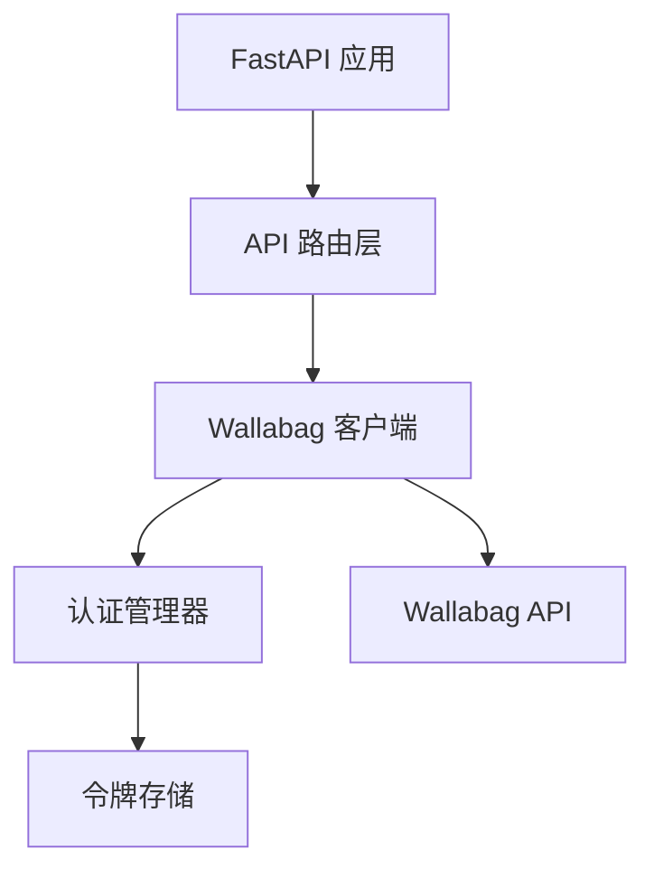

# Wallabag API 代理服务设计文档

## 项目概述

Wallabag API 代理服务是一个基于 Python FastAPI 构建的 HTTP 代理服务，用于简化 Wallabag API 的调用流程。该服务自动处理 OAuth2 认证流程，提供简洁的 API 接口供客户端使用。

## 系统架构

### 核心功能模块



## API 接口设计

### 1. 添加文章接口

**请求方式**: POST
**接口路径**: `/api/wallabag/entries`
**请求头**: `Content-Type: application/json`

**请求示例**:
```http
POST /api/wallabag/entries HTTP/1.1
Host: 192.168.66.160:10086
Content-Type: application/json

{
  "url": "https://mp.weixin.qq.com/s/sJ7LqNtQQCMSNBy-UnAtpA"
}
```

**响应示例**:
```json
{
  "message": "文章添加成功",
  "data": {
    "id": 123,
    "title": "文章标题",
    "url": "https://mp.weixin.qq.com/s/sJ7LqNtQQCMSNBy-UnAtpA",
    "content": "文章内容摘要..."
  }
}
```

### 2. 令牌管理接口

- **GET /api/wallabag/token-info** - 获取当前令牌信息
- **POST /api/wallabag/refresh-tokens** - 手动刷新令牌
- **DELETE /api/wallabag/tokens** - 清除所有令牌

## 认证流程

### OAuth2 令牌获取流程

系统采用 OAuth2 密码模式进行认证，自动管理令牌的获取、刷新和存储。

#### 1. 初始令牌获取

```bash
http POST https://wallabag.mac.axyz.cc:30923/oauth/v2/token \
    grant_type=password \
    client_id=1_3o53gl30vhgk0c8ks4cocww08o84448osgo40wgw4gwkoo8skc \
    client_secret=636ocbqo978ckw0gsw4gcwwocg8044sco0w8w84cws48ggogs4 \
    username=wallabag \
    password=wallabag
```

**响应格式**:
```json
{
  "access_token": "ZGJmNTA2MDdmYTdmNWFiZjcxOWY3MWYyYzkyZDdlNWIzOTU4NWY3NTU1MDFjOTdhMTk2MGI3YjY1ZmI2NzM5MA",
  "expires_in": 3600,
  "refresh_token": "OTNlZGE5OTJjNWQwYzc2NDI5ZGE5MDg3ZTNjNmNkYTY0ZWZhZDVhNDBkZTc1ZTNiMmQ0MjQ0OThlNTFjNTQyMQ",
  "scope": null,
  "token_type": "bearer"
}
```

#### 2. 令牌刷新流程

当访问令牌即将过期时（提前5分钟），系统自动使用刷新令牌获取新的访问令牌：

```bash
curl -X POST https://wallabag.mac.axyz.cc:30923/oauth/v2/token \
  -d "grant_type=refresh_token" \
  -d "client_id=YOUR_CLIENT_ID" \
  -d "client_secret=YOUR_CLIENT_SECRET" \
  -d "refresh_token=YOUR_REFRESH_TOKEN"
```

#### 3. 令牌存储策略

- 令牌信息存储在本地 `tokens.json` 文件中
- 包含访问令牌、刷新令牌、过期时间等信息
- 系统自动判断令牌有效性并进行相应处理

## 系统配置

### 环境变量配置

```bash
# Wallabag 服务器配置
WALLABAG_URL=https://wallabag.mac.axyz.cc:30923

# OAuth2 客户端配置
CLIENT_ID=your_client_id
CLIENT_SECRET=your_client_secret

# 用户凭证
USERNAME=your_username
PASSWORD=your_password

# 服务器配置
HOST=0.0.0.0
PORT=8000
DEBUG=False

# SSL 配置
VERIFY_SSL=True
```

### 配置优先级

1. 环境变量
2. 默认值

## 技术栈

- **框架**: FastAPI 0.104+
- **异步HTTP**: httpx 0.25+
- **数据验证**: Pydantic 2.4+
- **环境管理**: python-dotenv 1.0+
- **依赖管理**: uv
- **服务器**: uvicorn 0.24+

## 项目结构

```
wallabag_api/
├── api/
│   └── routes.py          # API 路由定义
├── core/
│   ├── auth.py           # 认证管理模块
│   └── client.py         # Wallabag 客户端
├── utils/
│   ├── exceptions.py     # 自定义异常处理
│   └── helpers.py        # 辅助工具函数
├── config.py             # 配置管理
├── main.py               # 应用入口
├── pyproject.toml        # 项目配置
└── tokens.json          # 令牌存储文件
```

## 部署要求

### 依赖管理

使用 `uv` 管理项目依赖：

```bash
# 安装依赖
uv pip install -r requirements.txt

# 或者使用 pyproject.toml
uv sync
```

### 运行服务

```bash
# 开发模式
uv run python main.py

# 生产模式
uvicorn main:app --host 0.0.0.0 --port 8000
```

## 错误处理

系统提供完善的错误处理机制：

- HTTP 状态码标准化
- 详细的错误信息返回
- 自动重试机制
- 令牌失效自动恢复

## 安全考虑

- 敏感信息通过环境变量管理
- SSL 证书验证可配置
- 令牌文件权限控制
- CORS 中间件配置